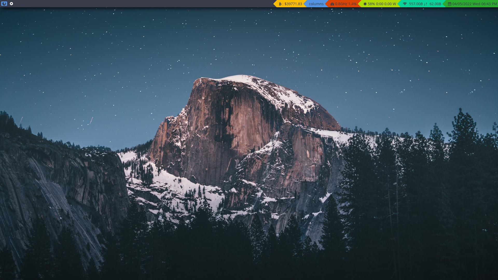

# Qtile:

## config file requirements

You can modify the config file according to your needs. However, if you don't want to change it, **you will need**:

* [scrot](https://www.tecmint.com/take-screenshots-in-linux-using-scrot/) for taking screenshots

* [rofi](https://linuxconfig.org/how-to-use-and-install-rofi-on-linux-tutorial) for launching apps

* [brave-browser](https://brave.com/) to navigate

* [psutil](https://pypi.org/project/psutil/): the python module for the CPU widget

* [slock](https://wiki.archlinux.org/title/Slock) to lock your screen

## Installing:

```bash
    sudo pacman -Sy scrot rofi slock
    paru brave-bin
    pip install psutil
```


## Where did I get the icons for the top bar?

If you want to choose your own icons, visit the [font awesome cheatsheet](https://fontawesome.com/v4.7/cheatsheet/) and just copy and paste the icons you like into the config file.

## Credits and help
The new top bar design was inspired by [Derek Taylor's config file](https://gitlab.com/dwt1/dotfiles/-/blob/master/.config/qtile/config.py) (aka [DistroTube](https://www.youtube.com/c/DistroTube)) and the vast majority of the knowledge can be found in the [Qtile documentation](http://docs.qtile.org/en/stable/).
